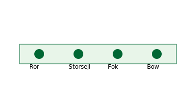

# J/70

J/70 er en sportskølbåd med plads til fire eller fem sejlere. Den har storsejl, fok og gennaker.

{data-glightbox}

## Roller ombord

- **Rorsmand:** styrer båden og kommunikerer med teamet.  
- **Storsejls trimmer:** justerer storsejlet og holder øje med vinden.  
- **Fok trimmer:** trimmer fokken og hjælper med balance.  
- **Bowman:** håndterer [gennaker](../ordbog.md#gennaker) og hjælper ved mærkerundinger.  
- **Taktiker (valgfri):** planlægger kurs og taktiske beslutninger.

## Opsætning

1. **Mast og rig:** sæt masten op, check vant og stag; juster rigspænding efter manual.  
2. **Sejl:** monter storsejl og fok; fokken rulles på forstaget; gennakeren pakkes i en nedgangs-pose.  
3. **Elektronik:** tænd instrumenter (vindmåler, kompas) og VHF.

## Trim

- **Storsejl:** udhal strammes i hård vind, løsnes i let vind; kicken kontrollerer mastens kurve.  
- **Fok:** forstagspænding justeres med underwand; skødepunktet flyttes frem i let vind og tilbage i hård vind.  
- **Gennaker:** hal masten op (halyard), skød ind til forliget er tæt; løs i læns.

## Manøvrer

- **Sætning af gennaker:** falden hejses, skødet tages ind, båden rettes op; hold øje med twist.  
- **Bomning med gennaker:** stram ny skøde før du slipper den gamle; drej langsomt for at holde fart.  
- **Nedtagning:** skød gennakeren bagud og træk den ned i nedgangen.  

## Sikkerhed ombord

Hold cockpit ryddeligt; pas på fødder i løjgang og skøder; kommuniker klart. Brug handsker ved trim og pas på ved bomninger.

## Vedligehold

Skyl rig, sejl og blokke efter sejlads. Smør spil og blokke med siliconespray. Check skrog for skader regelmæssigt.
