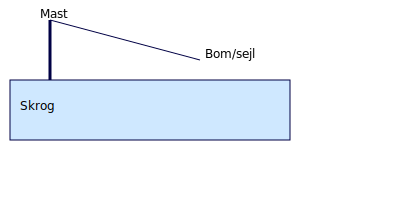

# Optimist

Optimistjollen er den klassiske begynderguide. Her får du en kort guide til rigging, trim og sejlads.

## Rigging

1. **Sæt masten:** masten sættes i mastefoden og sikres med snor.  
2. **Sæt sprydet:** sprydet holdes i mastefoden med sprydelinen.  
3. **Sæt sejl:** træk sejlet op ved at sætte faldet fast i toppen af sejl og hejse det.  
4. **Sæt sværd og ror:** sværdet sættes i sværdkisten; roret monteres med rortappen og sikres med en line.  
5. **Tjek skødet:** skødet går igennem bomskødeblokken og knyttes i hullet midt på bommen.

Lav en tjekliste og øv rigging på land; det tager under 5 minutter med rutine.

## Trim

Trim afhænger af vindstyrken:

- **0–3 m/s:** løs spryd, løs skøder; sid fremme i båden for at få skroget i vandet.  
- **4–7 m/s:** stram spryd og skøder; sid midt i båden og hæng lidt ud.  
- **8–12 m/s:** stram spryd, løs skødet en smule i vindstød; hæng langt ud.  
- **13+ m/s:** kun for øvede; brug mindre sejl eller bliv på land!

## Manøvrer

- **Vending (tack):** skift kurs mod vinden; se over skulderen, flyt vægt og roter roret langsomt; skift side hurtigt.  
- **Bomning (gybe):** hold fart, sejl med vinden bagfra, træk bommen over mens du holder hovedet lavt; hæng sejl ind når bommen har passeret.  
- **Start og mærkerundinger:** for kapsejlads; lær at time din start og runde bøjer tæt men uden at miste fart.

## Typiske fejl

- **For meget roret:** prøv at styre med vægten i stedet.  
- **For stramt skøde i let vind:** sejlene klapper og båden står stille.  
- **Vægt placeres forkert:** sidder du for langt tilbage, bremser du båden.

## Vedligehold

Skyl jollen med ferskvand efter sejlads, især sejl og beslag. Tjek for revner, slitage på tovværk og stram skruer. Opbevar jollen tørt om vinteren og dæk den til.
### Aldersspor
- 8–12 år: lær rigging med billedtrin; 1–2 manøvrer pr. pas.  
- 12–16 år: selvstændig rigging og fejlretning; fokus på fart vs. højde.
