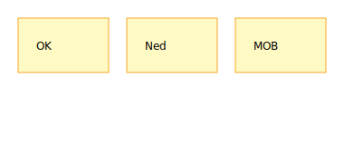

# Buddy‑system & kommunikation

Hold altid styr på din makker. Brug faste håndtegn og korte kommandoer.

## Hvad er buddy‑systemet?
To og to følges ad som makkere – på land og på vand. Man holder øje med hinanden (kulde, træthed), hjælper ved rigging/manøvrer og kalder hjælp, hvis noget går galt. Det mindsker ulykker og gør læring hurtigere, fordi man giver hinanden feedback.

## Buddy‑tjek
- [ ] Vest passer og er lukket  
- [ ] Tøj/varme ok (handsker/hue ved behov)  
- [ ] Kniv + fløjte  
- [ ] Vand/snack  
- På vandet: tjek‑ind ved manøvrer og ca. hver 10. minut.

## Håndsignaler (eksempler)
- Tommelfinger op: okay.  
- Flad hånd ned: sæt dig ned/ro på.  
- Pegning + råb “MOB!” ved mand over bord.

## Kald ombord (kort og klart)
- “Klar til [vending](../ordbog.md#bidevind)?” – “Klar!” – “Vender!”  
- “Klar til [bomning](../ordbog.md#laens)?” – “Klar!” – “Bommer!”

{data-glightbox}

### Aldersspor
- 8–12 år: simple tegn og faste kald, leder bekræfter.  
- 12–16 år: patruljefører leder kald og bekræftelser.

### Se også
- [Sikkerhed](../sikkerhed/index.md)  
- [VHF & kommunikation](../vhf.md)  
- [MOB‑checkliste](../cheatsheets/mob-checkliste.md)
