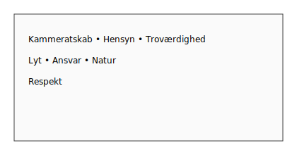

# Spejderloven – praktisk på vandet

For hvert punkt i spejderloven: konkrete handlinger ombord og refleksionsspørgsmål til patruljen.

## 1. En god kammerat
- Del viden og hjælp ved rigging og fejl.  
- Tal ordentligt ved pres (start, hård vind).  
Refleksion: Hvad gjorde vi for at løfte hinanden i dag?

## 2. Hensynsfuld og hjælpe andre
- Hold udsyn, giv plads ved mærker og i havn.  
- Tilbyd hjælp til andre joller i problemer.  
Refleksion: Hvor tog vi hensyn på vandet?

## 3. Til at stole på
- Mød forberedt (vest, udstyr), hold dine aftaler og roller.  
- Meld ærligt ud om du er træt/kold.  
Refleksion: Kunne patruljen regne med mig i dag?

## 4. Høre andre – dan egne meninger
- Lyt til rorsmand/taktiker og giv konstruktiv feedback.  
- Vælg sammen øvelser og taktik.  
Refleksion: Hvad ændrede vi pga. input fra andre?

## 5. Medansvar i familie og samfund
- Pas på udstyr, ryd op på broen og i skuret.  
- Sejl hensynsfuldt ift. andre brugere af vandet.  
Refleksion: Hvilket ansvar tog vi i dag?

## 6. Værn om naturen
- Undgå at skræmme fugle; saml affald op.  
- Brug miljøvenlig solcreme og minimer spild.  
Refleksion: Hvad gjorde vi for naturen?

## 7. Egen tro – respektere andres
- Respekt for forskelligheder i patruljen; plads til pauser og behov.  
- Tal ordentligt – også når vi er uenige.  
Refleksion: Hvordan viste vi respekt i dag?

